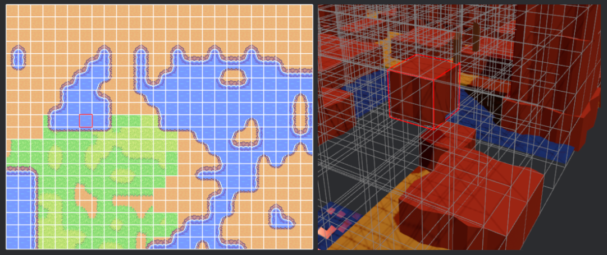

# Bevy Ghx Grid

Uses and exports [`ghx_grid`](https://github.com/Henauxg/ghx_grid), as well as additional plugins and utilities dedicated to [`Bevy`](https://github.com/bevyengine/bevy).

## Grid debug plugin

`GridDebugPlugin` provides debug utilities for the grid-types within `ghx_grid`:
  - Can draw a debug view of any 2d/3d grid
  - Can draw debug markers on any cells of a grid (controlled via bevy events)

Use it by inserting a `DebugGridView3d` bundle on your `Grid` entity (or `DebugGridView2d`, depending on your Bevy Camera).

  

## Cargo features

*Find the list and description in [Cargo.toml](Cargo.toml)*

- `debug-plugin` *[default]*: compiles the grid debug plugin and its systems.
- `reflect` *[default]*: enables `ghx_grid` reflect feature.

*See also the [main crate](https://github.com/Henauxg/ghx_grid#cargo-features) cargo features*

## Compatible Bevy versions

| **bevy_ghx_grid** | **ghx_grid** | **bevy** |
| :---------------- | :----------- | :------- |
| 0.6               | 0.6          | 0.16     |
| 0.5               | 0.5          | 0.15     |
| 0.4               | 0.4          | 0.14     |
| 0.3               | 0.3          | 0.13     |
| 0.2               | 0.2          | 0.13     |
| 0.1               | 0.1          | 0.12     |

## License

### Code

bevy_ghx_grid is free and open source. All code in this repository is dual-licensed under either:

* MIT License ([LICENSE-MIT](LICENSE-MIT) or [http://opensource.org/licenses/MIT](http://opensource.org/licenses/MIT))
* Apache License, Version 2.0 ([LICENSE-APACHE](LICENSE-APACHE) or [http://www.apache.org/licenses/LICENSE-2.0](http://www.apache.org/licenses/LICENSE-2.0))

at your option.

Unless you explicitly state otherwise, any contribution intentionally submitted for inclusion in the work by you, as defined in the Apache-2.0 license, shall be dual licensed as above, without any additional terms or conditions.
